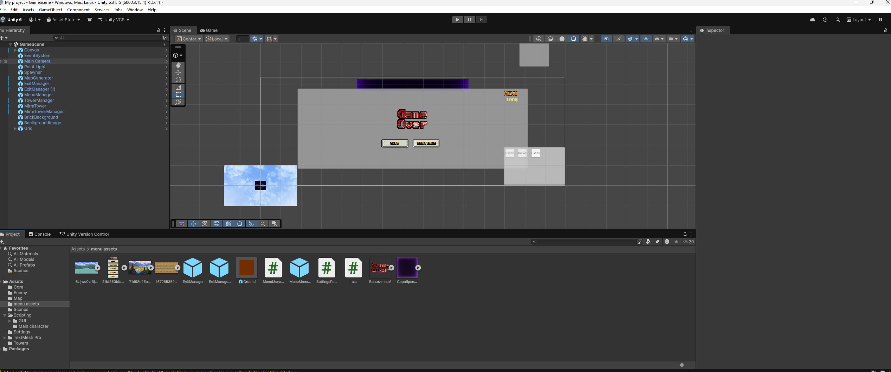
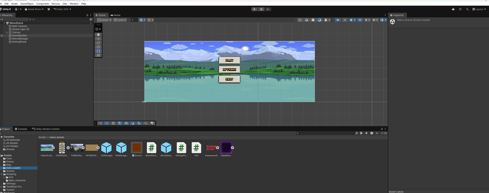
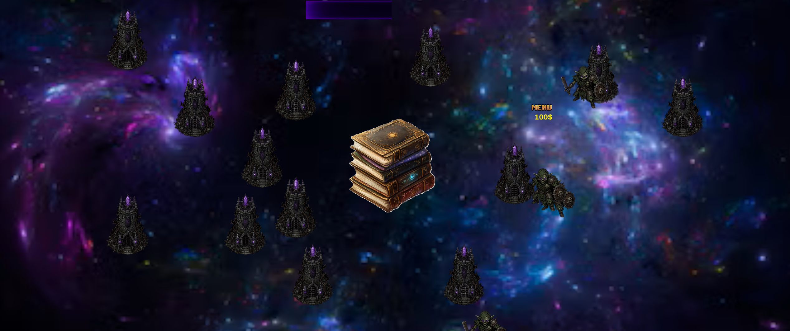
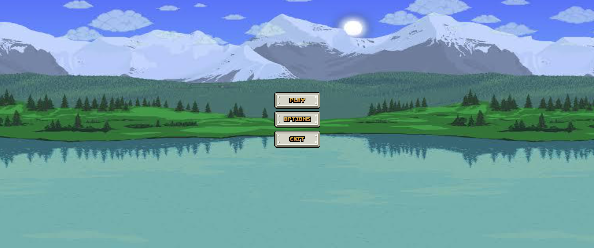

# Название проекта
Инмирмация

# Описание проекта
Компьютерная игра на Unity в жанре философской песочницы. 

# Скриншоты

# Технологический стек
Unity
C#

## Инструкция по запуску
1) клонировать репозиторий: git clone "URL репозитория"
2) перейти в папку "Build"
3) открыть файл My project.exe

# Статус проекта

Закончена и реализована первая версия проекта.

# Запуск тестов
1) Запустить проект в Unity
2) перейти в Window -> General -> Test Runner
3) перейти в PlayMode
4) нажать run All
